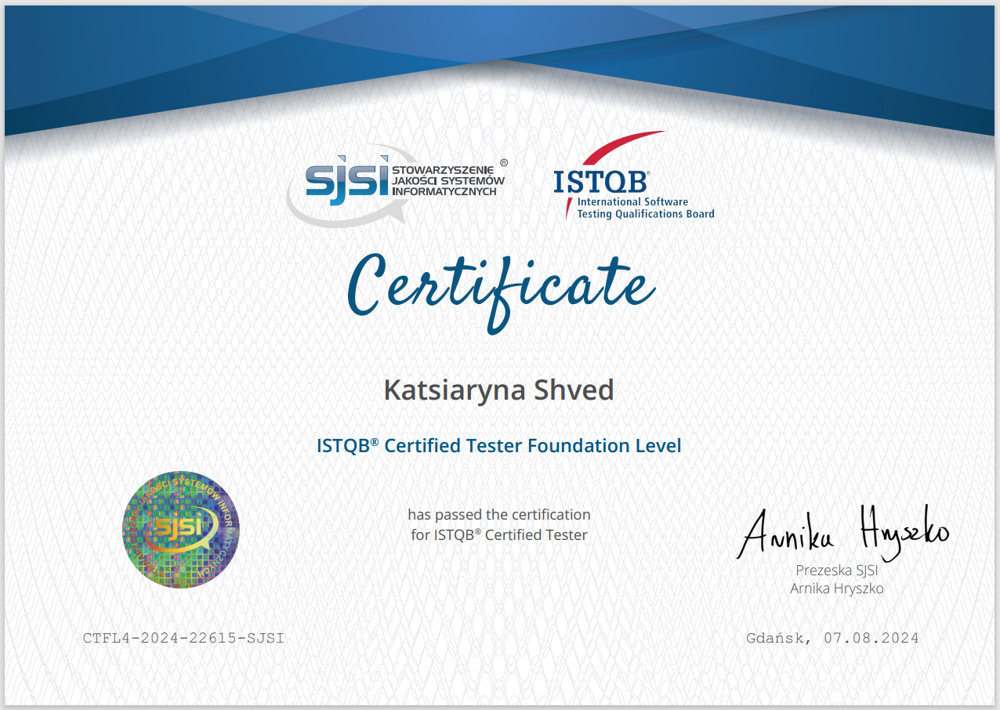
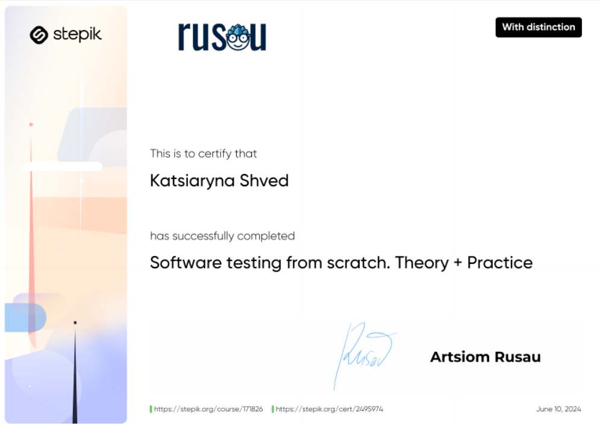
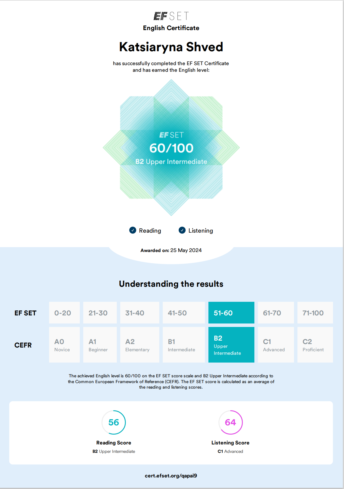

# Junior QA engineer

👋 Hi! 
  **TBD** 

### My skills 

 📖 Testing fundamentals (including ISTQB)
 📚 Documentation: test case, bug report
 🐞 Confluence/Jira (+Zephyr Scale), Azure, YouTrack
 🗂️ TMS: QASE, TestRail
 📦 Database: PostgreSQL, MySQL (GUI & CLI): "full form" of SQL query + join, subqueries	
 💻 Web: DevTools, protocols, basic knowledge of HTML and CSS
 🔗 API: Postman, Soap UI
 🐈‍⬛ Git/GitHub
 🍵 Java: Basics
 📱 **TBD**
 📷 Photoshop
 🪟 Microsoft 365 

### Experience
**TBD**

### Education

🎓 ISTQB Certified Tested Foundation Level v.4.0

 

🎓 I finished the course 'Software testing from scratch. Theory + practice'

 

🌍 Have a good English-level with apportunity to speake and read documentation

## My CV

  

