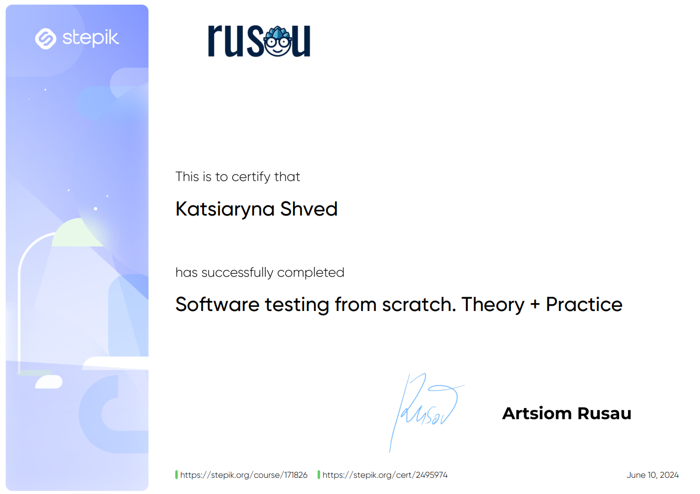

# Tester / QA engineer

👋 Hi! 
 My name is Kate and I'm here to provide the best quality of your software product. Here are some of my projects. 

### My skills 

📖 Testing fundamentals (testing rules, typing classification, STLC and STLC, Software development models)
 ⚙️ Testing techniques
 📚 Documentation: checklist, test case, bug report
 🐞 Jira, Azure, YouTrack
 🗂️ TMS: QASE
 📦 Database: PostgreSQL (create, drop, insert, select, where, update, group by, having, order by, join, subqueries)	
 💻 Web: DevTools, protocols, basic knowledge of HTML and CSS
 🔗 API: Postman, Soap UI
 🐈‍⬛ Git/GitHub

### Education

🎓 I finished the course 'Software testing from scratch. Theory + practice'

🌍 Have a good English-level with apportunity to speake and read documentation

### My CV

  

  

###

  
  
  
  

